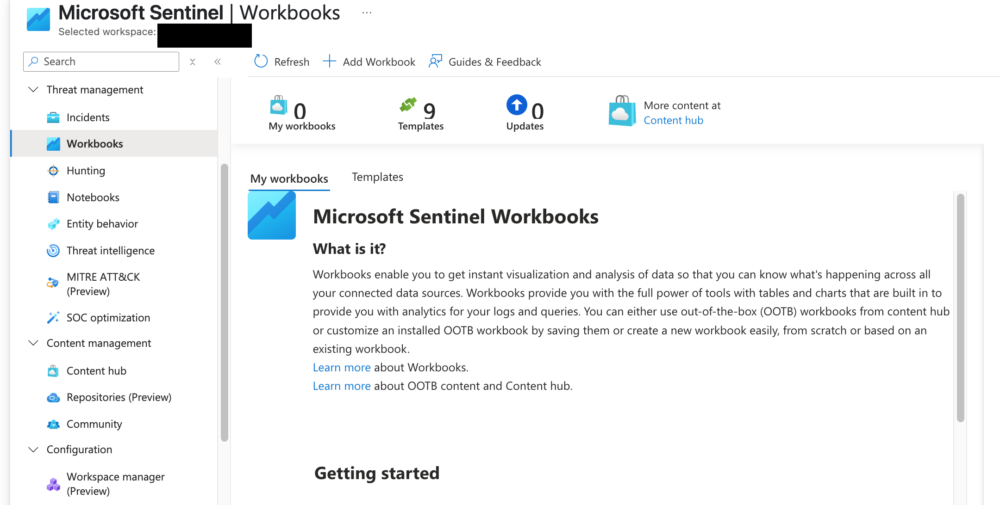
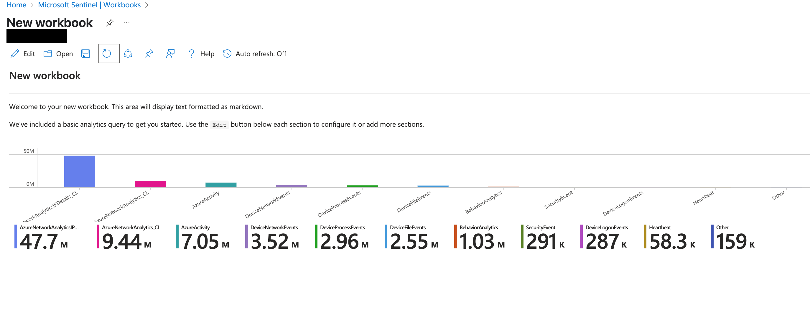
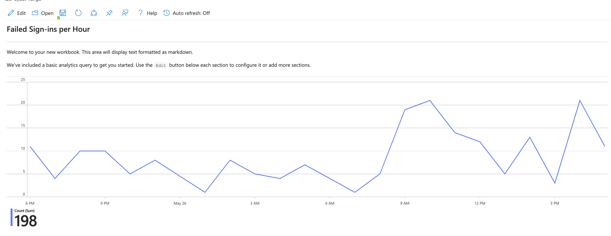
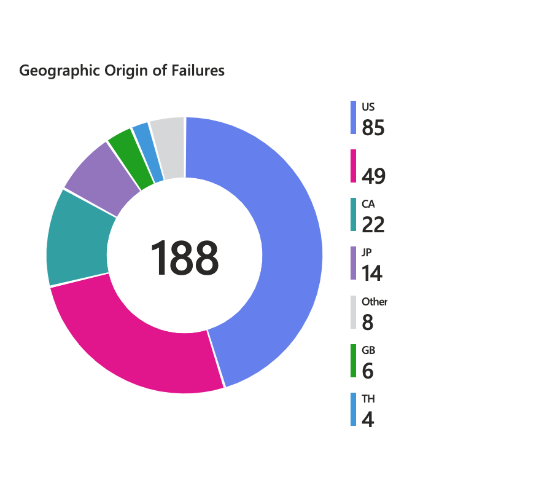
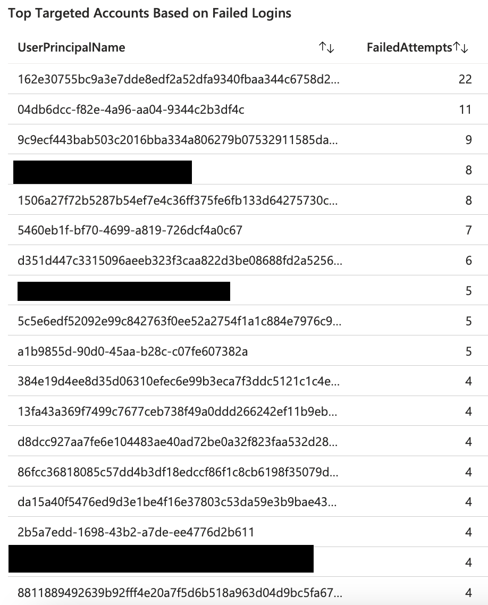
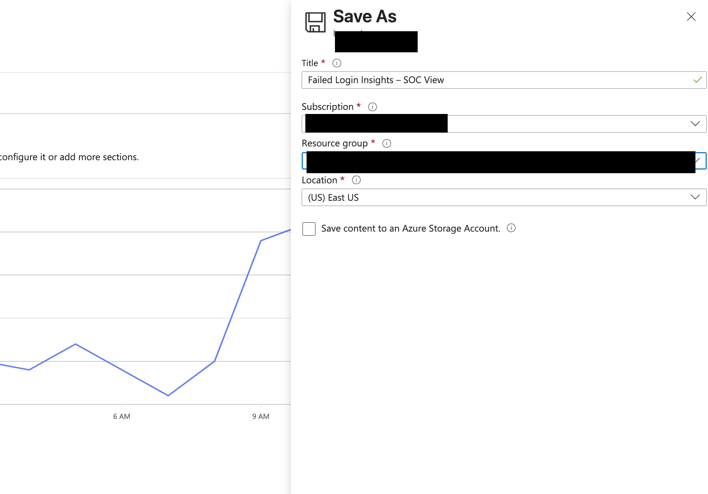
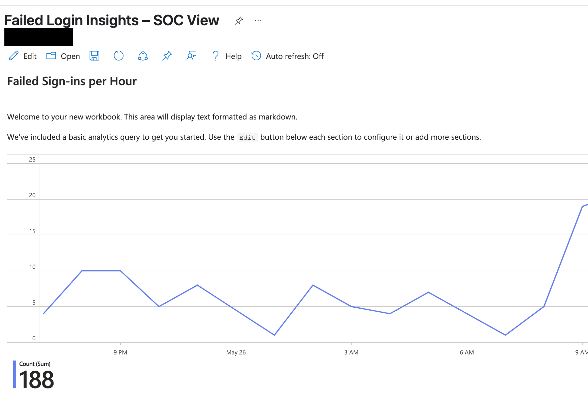

# 📊 Microsoft Sentinel Workbook Visualizations 

This hands-on lab explores Microsoft Sentinel's Workbook feature to visualize and investigate failed login attempts using real log data. The goal was to transform raw security events into meaningful, layered dashboards that support real-time analysis—just like a SOC analyst would use.

---

## 🔧 Key Skills Developed
- Writing Kusto Query Language (KQL) queries
- Creating time-series and bar chart visualizations
- Identifying suspicious login patterns by user and geography
- Saving and sharing reusable dashboards for SOC monitoring

---

## 🛠️ Queries Used
- `failed-signins-query.kql`
- `failed-logins-by-location.kql`
- `top-targeted-accounts.kql`

---

## 🖼️ Screenshots

### Step 1: Navigate to Sentinel Workbooks

### Step 2: New Workbook Interface

### Step 3: Failed Sign-ins per Hour (Timechart)

### Step 4: Failed Logins by Location (Pie Chart)

*This chart shows the geographic origin of failed login attempts over the last 24 hours. Visualizing this data helps analysts detect unusual patterns, such as unexpected access attempts from foreign regions.*

### Step 5: Top Targeted Accounts Based on Failed Logins

*This table summarizes which accounts experienced the most failed sign-in attempts. Many of these appear to be machine/service accounts, which could indicate automation issues or targeted enumeration.*

### Bonus: Save Workbook Dialog

### Final Dashboard View

---

## 🔄 Reflection

This lab taught me how to go beyond basic queries and use visual analysis to answer real-world security questions—such as who is being targeted, when, and from where. These are skills I aim to carry forward into SOC analyst interviews and practical environments.

